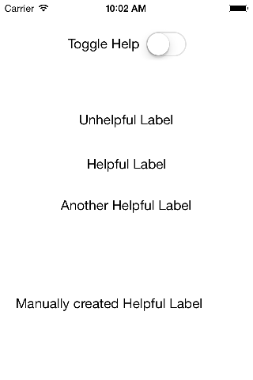
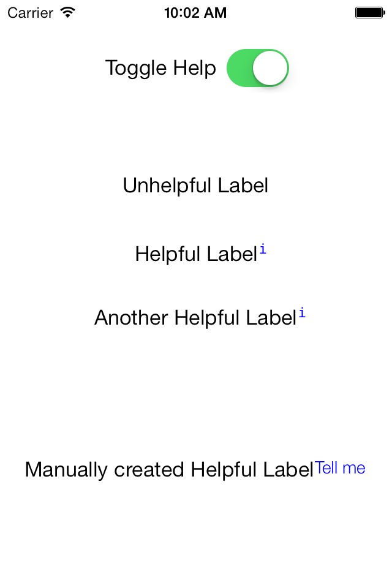
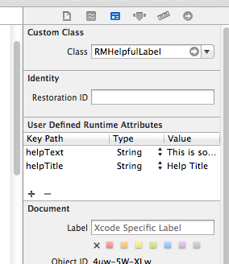

RMHelpfulLabel
==============

A `UILabel` implementation that allows easily adding pop-up, context-sensitive help

A demo project showing most of the features is included.

  

Feedback welcome!

Installation
============

Drag the two `RMHelpfulLabel` files to your project.

Use
===
Create your `UILabel`s as usual in Interface Builder.  Set their custom class to `RMHelpfulLabel`
and add a couple of User Defined Runtime Attributes in the inspector: helpText (mandatory) and helpTitle (optional).

In your Controller toggle the help visibility with a call to `[RMHelpfulLabel setHelpEnabled:]`

Various customisations exist - check the demo project.

That's it.